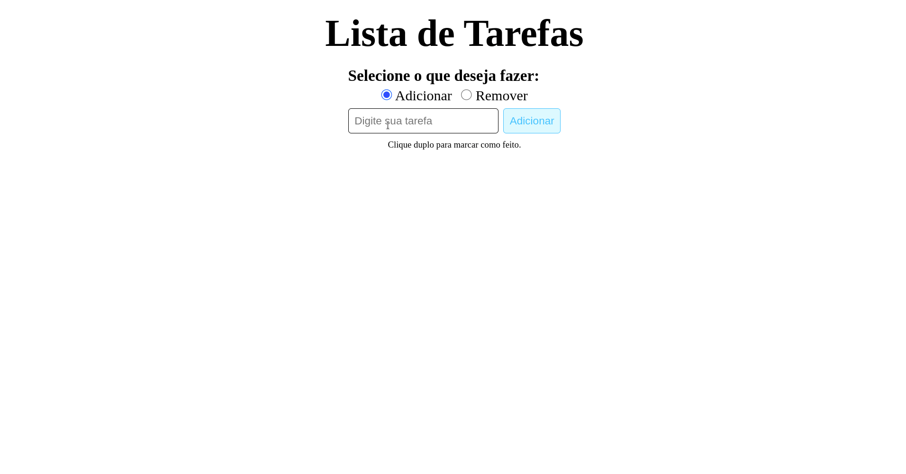

# To-do List / Lista de Tarefas

  

  <a href="#clipboard-sobre-o-projeto">Sobre o Projeto</a>&nbsp;&nbsp;&nbsp;|&nbsp;&nbsp;&nbsp;
  <a href="#computer-tecnologias-utilizadas">Tecnologias</a>

## :clipboard: Sobre o Projeto
To-do List / Lista de Tarefas
- Add item a Lista
- Marcar item como feito com clique duplo
- Remover item, acionando a aba remover e clique duplo no item

## :computer: Tecnologias utilizadas
- HTML
- CSS
- JavaScript
